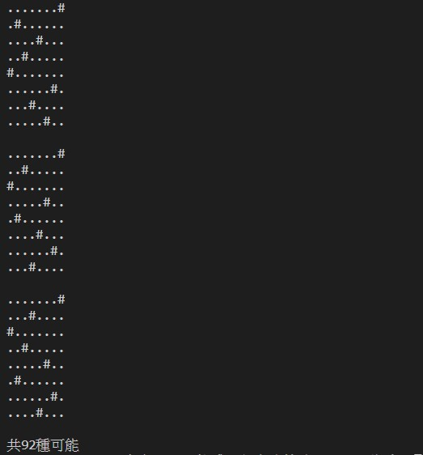

# 課程:軟體工程與演算法 -- 期末報告-八皇后問題


### 八皇后問題

1. 八皇后問題是一個以西洋棋為背景的問題：如何能夠在8×8的西洋棋棋盤上放置八個皇后，使得任何一個皇后都無法直接吃掉其他的皇后？為了達到此目的，任兩個皇后都不能處於同一條橫行、縱行或斜線上。八皇后問題可以推廣為更一般的n皇后擺放問題：這時棋盤的大小變為n×n，而皇后個數也變成n。若且唯若n = 1或n ≥ 4時問題有解。

2. 八個皇后在8x8棋盤上共有4,426,165,368（64C8）種擺放方法，但只有92個互不相同的解。如果將旋轉和對稱的解歸為一種的話，則一共有12個獨立解，具體如下：


3. 程式碼

```
per_result = []
def per(lst,s,e):
    if s == e:
        per_result.append(list(lst))
    else:
        for i in range(s,e):
            lst[i],lst[s] = lst[s],lst[i]
            per(lst,s+1,e)#遞迴
            lst[i],lst[s] = lst[s],lst[i]

def shear(lst):
    result = 0
    for i in range(len(lst)):
        for j in range(i+1,len(lst)):
            if(abs(lst[j] - lst[i]) == abs(j-i)):
                result += 1
    if(result > 0):
        return True
    else:
        return False

def stamp(st):
    for i in st:
        for j in range(len(i)):
            a = ("."*(i[j]-1)+"#"+"."*(len(i)-i[j]))
            print(a,"\t")
        print(" ")
num = 8
lst = [i+1 for i in range(num)]
per(lst,0,num)
queen_lst = []
for i in per_result:
    if(shear(i) == False):
        queen_lst.append(i)
stamp(queen_lst)
print("共{:d}種可能".format(len(queen_lst)))
```
4. 測試結果





### 參考資料

[八皇后問題-維基百科](https://zh.wikipedia.org/zh-tw/%E5%85%AB%E7%9A%87%E5%90%8E%E9%97%AE%E9%A2%98)

[回朔法解決N皇后問題](https://blog.csdn.net/zhj_1121/article/details/103059144#t7)